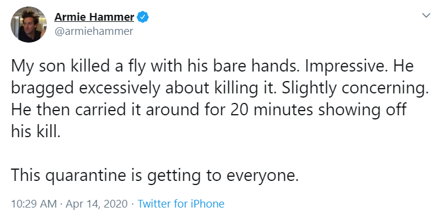
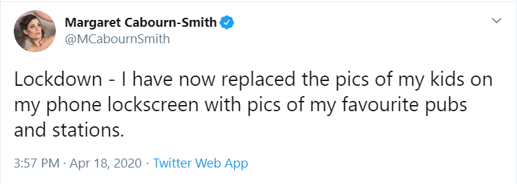
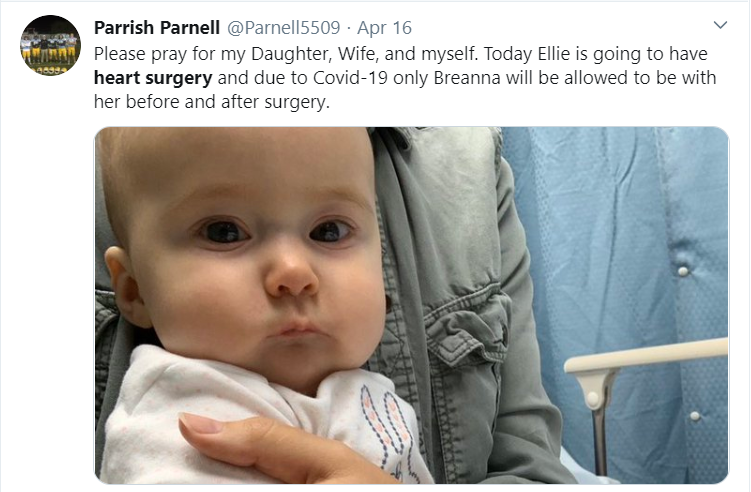

```{r setup, layout="1-body-outset", include=FALSE}
knitr::opts_chunk$set(echo = FALSE)
```

```{r include=FALSE}
library(rtweet)
library(tidyverse)
library(tidytext)
library(stringr)
library(widyr)
library(knitr)
library(igraph)
library(ggraph)
library(ggtext)
library(patchwork)
library(markdown)

theme_set(theme_minimal())
```


It is 3:00pm Sunday afternoon, my wife lays on the floor staring at the ceiling. Our 1.5 y/o daughter sits a few feet away throwing a tantrum because she does not want to color with crayons. I am in the kitchen washing what seems to be a never ending pile of dishes. I look at my wife and joke, "On day 7 the family officially began to break down." 

We had just reached one full week of quarantine together.

The corona pandemic has thrown households all over the world into a whirlwind. Ours has been no different.

As I do my nightly scrolls through twitter, I feel like I have seen an uptick in parents tweeting about there kids.

Some have been very funny:



Others heartbreaking:


I decided to look more closely and dig deeper into what parents are tweeting about while in quarantine with there families. The analysis first explains the tweets that were gathered and how they are prepared to be analyzed. I then make conclusions based on common words and phrases being used. I'll finish by performing sentiment analysis to get a feel for the tone of the tweets and explain some of the pitfalls this type of analysis has with this particular data.

# Gathering the Tweets
Using the 'rtweet' package, I accumulated over 17,000 tweets. I used the following search parameters to do my best to ensure I was receiving parents tweets about there kids:

* The tweet must contain one of: "my kids", "my daughter", "my son", "my kids", "my daughters", or "my son"
* The tweet also must contain one of: COVID OR lockdown OR quarantine OR stayathome

The search gathered tweets between April 11, 2020 and April 19, 2020.

```{r include=FALSE}
# Search twitter for a combination of tweets. Tweets contain one of:"my kids" OR "my daughter" OR "my son" OR "my kids" OR "my daughters" and one of:COVID OR lockdown OR quarantine OR stayathome
# 
# test <-
#   search_tweets(
#     q = '"my kids" OR "my daughter" OR "my son" OR "my kid" OR "my daughters" OR "my sons" COVID OR lockdown OR quarantine OR stayathome -filter:retweets',
#     n = 18000,
#     type = "mixed",
#     include_rts = FALSE,
#   )

# parent_tweets <- test %>%
#   mutate(tweet_num = row_number()) %>% 
#   select(tweet_num, user_id, status_id, created_at, screen_name, text, source, favorite_count, retweet_count)
# 
# 
# write_csv(parent_tweets, "parent_tweets.csv")
```

# Minimal Data Cleaning!
The great thing about scraping Twitter using the rtweet package is that it organizes the data into a dataframe for you. This eliminates a lot of the hassle that comes along when dealing with textual data.

To get the data ready for analysis, urls and some special characters we often see in tweets are removed. Stop words are also removed. Stop words are extremely common words ("of", "the", "to") typically not useful for analysis.

Using the unnest_tokens() function from the tidytext package each word is extracted from every tweet. By default, the function converts all words to lower case and strips punctuation. A special "tweets" tokenizer is used in the call that retains hastags and mentions of usernames.

All words that were included in the tweet search are also removed. If left, these words would take over much of the analysis.

```{r include=FALSE}
parent_tweets <- read_csv("parent_tweets.csv")

remove_reg <- "&amp;|&lt;|&gt;"
remove_url <- " http.*"


parent_words <- parent_tweets %>%
  mutate(text = str_remove_all(text, remove_reg)) %>%
  mutate(text = str_remove_all(text, remove_url)) %>%
  distinct(text, .keep_all = TRUE) %>%
  unnest_tokens(word, text, token = "tweets", strip_url = TRUE) %>%
  #removing common words and words that appear in search
  filter(!word %in% stop_words$word,
         !word %in% str_remove_all(stop_words$word, "'"),
         str_detect(word, "[a-z]"),
         !word %in% c("covid", "covid19", "quarantine", "lockdown", "stayathome", "kids", "daughters", "sons", "kid", "daughter", "son", "#covid", "#covid19", "#lockdown", "#quarantine", "#stayathome"))
```


# Word Counts, Pairs, and Correlations
First, I look at the most common words showing up in these tweets.

```{r message=FALSE, echo=FALSE}
# total counts of all words in tweets
word_counts <- parent_words %>% 
  count(word, sort = TRUE)

word_counts %>%
  top_n(10) %>% 
  ggplot(aes(n, fct_reorder(word, n))) +
  geom_col() + 
  labs(x = "",
       y= "",
       title = "Most Common <b style='color:#38A1F3'>Words</b> Parents Use in Tweets About<br>There Kids During COVID19") + 
  theme(plot.title.position = "plot",
        plot.title = element_markdown(),
        panel.grid.minor = element_blank(),
        panel.grid.major.y = element_blank(),
        axis.text.y = element_text(color = "#38A1F3", face = "bold"))
```

The most common word is "home". This should not come as a surprise since most parents are at home with their kids 24/7 right now. "Birthday" cracks the top five. Looking through tweets containing "birthday", alot of parents are dealing with cancelled birthday parties or trying to do unique things for there child's birthday. My sister had to cancel her sons birtday party and instead threw together a virtual party over Zoom.

At first glance, I thought "school" and "due" may be related but "due" is being commonly used in phrases like "due to lockdown..." or "due to shutdown...". Schooling for children is certainly one of the biggest issues parents are facing right now.

It's refreshing to see "love" in the top 10. As frustrating as things can get during this time, the extra time with my family has been amazing.

To see if I can find more common messages in tweets I take a look at combinations of words that are appearing in the same tweet. The table below shows the top 10 most common combinations.

```{r echo=FALSE}
word_pairs <- parent_words %>% 
  pairwise_count(item = word, feature = tweet_num, sort = TRUE) %>% 
  distinct(n, .keep_all = TRUE) %>% 
  rename("Word 1" = item1, "Word 2" = item2, "Number of Tweets" = n) %>% 
  head(10)

kable(word_pairs, format = "markdown")
```
Unsurprisingly, we see the combination of "happy" and "birthday" top the list. "Birthday" shows up in four of the top ten combinations. I find the most revealing is "birthday" and "fan". This combination is primarily due to parents reaching out to celebrities asking to wish there child a happy birthday.

While looking at word combos gave more insight, most of the combinations were also the most common invidually used words. Below I look at correlations among word combinations.


```{r echo=FALSE}
parent_cors <- parent_words %>% 
  group_by(word) %>% 
  filter(n() >= 20) %>% 
  pairwise_cor(word, tweet_num, sort = TRUE) %>% 
  rename("Word 1" = item1, "Word 2" = item2)

parent_cors %>%
  filter(correlation > .40) %>%
  graph_from_data_frame() %>%
  ggraph(layout = "fr") +
  geom_edge_link(aes(edge_alpha = correlation), show.legend = FALSE) +
  geom_node_point(color = "#38A1F3", size = 5, alpha = .75) +
  geom_node_text(aes(label = name), repel = TRUE) +
  theme_void() +
  labs(title = "Most Correlated Word Combos")

```

The network graph above shows all word combinations that had a correlation greater than .40. Alot of inference can be made from this graph about what parents have been tweeting about during COVID19.

Things directly related to the pandemic like "front line" and "social distancing". I have heard more than a few stories of parents working on the front lines and unable to see there kids over the past few weeks. Other front line combinations may be parents tweeting about there older children who work on the front lines. 

It looks like harry potter, bike rides, and ice cream have been forms of entertainment during this period. Egg hunt also appears as these tweets happened over Easter. Many egg hunt traditions were forced to cancel and parents scrambled to put together something as best they could.  

My favorite correlated combination I see is "silver lining". I suspect most of these tweets are parents expressing how they are enjoying this additional time with there children. I know I am.

One of the few triangles that forms in this network contains the words "temporary", "entertain", and "bits". My initial thought on this was there was a potential data cleaning issue here. In the end, it ended up being a single user tweeting at many different accounts her Amazon wish list that contains "temporary bits of entertainment". 

The table below shows the top 10 most correlated word combos found in the tweets.

```{r echo=FALSE}
top_10_cors <- parent_cors %>% 
  distinct(correlation, .keep_all = TRUE) %>%
  head(10)

kable(top_10_cors, format = "markdown")
```

# Sentiment Analysis
I conclude with some sentiment analysis. Sentiment analysis aims to find the emotion tone coming across in text. It involves classifying the words of a text to certain tone or emotion, often "positive" or "negative". The classification of words is determined by a type of dictionary or lexicon. The total number of "postive" words are compared to the total "negative" words to determine the overall tone of the text.  

This particular analysis features the use of three different sentiment lexicons NRC <https://saifmohammad.com/WebPages/NRC-Emotion-Lexicon.htm>, Bing <https://www.cs.uic.edu/~liub/FBS/sentiment-analysis.html>, and Afinn <https://github.com/fnielsen/afinn/tree/master/afinn/data>. 

The NRC lexicon contains 6468 unique words and 10 sentiment classifications. A word can be classified as multiple sentimets. For example, the word "admirable" is classified as three different sentiments "joy", "positive", and "trust".

The Bing lexicon contains 6783 unique words that are classified as either "negative" or "positive".

The Afinn lexicon contains 2477 unique words. Each word is assigned a value from -5 to 5. -5 represents the most negative score and 5 the most positve.

Below I take a look at overall sentiment across all of the parents tweets. 

```{r echo=FALSE}
nrc <- get_sentiments("nrc")
bing <- get_sentiments("bing")
afinn <- get_sentiments("afinn")

nrc_sentiment <- nrc %>% 
  left_join(select(word_counts, everything()), by = "word") %>%
  replace_na(list(n = 0)) %>% 
  group_by(sentiment) %>%
  summarize(total_sentiment = sum(n)) %>% 
  ungroup()

bing_sentiment <- bing %>% 
  left_join(select(word_counts, everything()), by = "word") %>%
  replace_na(list(n = 0)) %>% 
  group_by(sentiment) %>%
  summarize(total_sentiment = sum(n)) %>% 
  ungroup()

afinn_sentiment <- afinn %>% 
  left_join(select(word_counts, everything()), by = "word") %>%
  replace_na(list(n = 0)) %>% 
  mutate(score = value * n) %>% 
  arrange(desc(score))
```

```{r echo=FALSE}
g1_nrc <- nrc_sentiment %>% 
  mutate(percentage = total_sentiment/sum(total_sentiment)) %>% 
  ggplot(aes(percentage, fct_reorder(sentiment, percentage))) + 
  geom_col() +
  scale_x_continuous(breaks = c(.05, .10, .15, .20), labels = c("5%", "10%", "15%", "20%")) +
  labs(y = "",
       x = "",
       title = "NRC") +
  theme(
        plot.title = element_text(size = 11, hjust = .5, face = "bold"),
        panel.grid.minor = element_blank(),
        panel.grid.major.y = element_blank(),
        axis.text.y = element_text(color = "#38A1F3", face = "bold"))

g2_bing <- bing_sentiment %>% 
  mutate(percentage = total_sentiment/sum(total_sentiment)) %>% 
  ggplot(aes(percentage, fct_reorder(sentiment, percentage))) + 
  geom_col() +
  scale_x_continuous(breaks = c(.10, .30, .50), labels = c("10%",  "30%",  "50%")) +
  labs(y = "",
       x = "",
       title = "Bing") +
  theme(
        plot.title = element_text(size = 11, hjust = .5, face = "bold"),
        panel.grid.minor = element_blank(),
        panel.grid.major.y = element_blank(),
        axis.text.y = element_text(color = "#38A1F3", face = "bold"))

g3_afinn <- afinn_sentiment %>% 
  mutate(sentiment = if_else(value < 0, "negative", "positive")) %>% 
  group_by(sentiment) %>% 
  summarize(total_sentiment = sum(n)) %>% 
  ungroup() %>% 
  mutate(percentage = total_sentiment/sum(total_sentiment)) %>% 
  ggplot(aes(percentage, fct_reorder(sentiment, percentage))) + 
  geom_col() +
   scale_x_continuous(breaks = c(.10, .30, .50), labels = c("10%",  "30%",  "50%")) +
  labs(y = "",
       x = "",
       title = "Afinn") +
  theme(
        plot.title = element_text(size = 11, hjust = .5, face = "bold"),
        panel.grid.minor = element_blank(),
        panel.grid.major.y = element_blank(),
        axis.text.y = element_text(color = "#38A1F3", face = "bold"))

patch <- g1_nrc / (g2_bing + g3_afinn)

patch + plot_annotation(
  title = "<b style='color:#38A1F3'>Sentiment</b> Classification by Lexicon",
  subtitle = "(Percentage of Words Classified as...)",
  theme = theme(plot.title = element_markdown(size = 18))
)
  
```

Each of the three lexicons, show different results. The NRC lexicon classifies close to a quarter of the words in the tweets as "positive". This is pretty significant given it has 10 different classifications. "Trust" was the second highest classification at around 12.5% and "negative" was not far behind in third.

The Bing lexicon leaned more toward a negative sentiment, while Afinn leaned just slightly positive.

These results illustrate some of the pitfalls sentiment analysis can have, as I got three different results depending on the lexicon I was using. 

Sentiment analysis on social media data poses a ton of challenges. It can be tough to detect sarcasm, negation phrases like "not good" are tough to classify correctly, and it can be challenging to know who is providing the observations.

Below, I look at a problem with sentiment analysis very specific to this dataset of tweets.

```{r echo=FALSE}
afinn_sentiment %>%
  select(word, score) %>%
  top_n(10, score) %>%
  ggplot(aes(score, fct_reorder(word, score))) +
  geom_col() +
  labs(x = "Afinn Score",
       y = "",
       title = "Top 10 Positive <b style='color:#38A1F3'>Words</b> by Afinn") +
  geom_curve(
    data = data.frame(
      x = 1020.5726856118,
      y = 3.94527258167616,
      xend = 665.868061953313,
      yend = 1.99870968389784
    ),
    mapping = aes(
      x = x,
      y = y,
      xend = xend,
      yend = yend
    ),
    angle = 90L,
    colour = "black",
    curvature = -0.38,
    arrow = structure(list(
      angle = 30,
      length = structure(
        0.1,
        class = "unit",
        valid.unit = 2L,
        unit = "inches"
      ),
      ends = 2L,
      type = 2L
    ),
    class = "arrow"),
    inherit.aes = FALSE,
    show.legend = FALSE
  ) +
  geom_text(
    data = data.frame(x = 1016.75865740042, y = 4.20055951908971,
                      label = "\"Tested Positive?\""),
    mapping = aes(x = x, y = y,
                  label = label),
    angle = 0L,
    lineheight = 1L,
    hjust = 0.5,
    vjust = 0.5,
    colour = "black",
    family = "sans",
    fontface = "plain",
    inherit.aes = FALSE,
    show.legend = FALSE
  ) +
  theme(
    plot.title.position = "plot",
    plot.title = element_markdown(),
    axis.text.y = element_text(color = "#38A1F3", face = "bold")
  )


```

The chart above shows the words that had the highest postive value as classified by the Afinn lexicon. Coming in at number 9 is the actual word "positive". If you take a look back at the network graph of correlated word combos, "positive" connects with "tested". Given these tweets are sent during the corona virus pandemic, its less likely the actual word "positive" is reflecting a positive tone. It is even more unlikely, given we already know "tested" and "postive" are highly correlated in the set of these tweets. 

This is a clear example of how sentiment analysis can often be misleading.

# Conclusion
The analysis was able to dig out some underlying themes that parents are tweeting about during this time. Two big ones were birthday and school. Children's birthdays are having to be celebrated in untraditional ways and home schooling has become the main form of education.

There were some interesting correlations among words and perhaps parents are seeing that the "silver lining" to this crazy time is being able to spend more time with their kids.

Sentiment analysis as it often can proved to be fairly challenging here. Additional steps such as looking at bigrams and adjusting the lexicons more appropriately to the dataset are specific ways to improve the analysis. Given the results I saw and exploring the tweets further, I would generally say the tweets sway more positively. Which should not come as a surprise given these tweets are coming from parents about there children.

I hope everyone out there is staying safe and able to find a silver lining to this crazy time in our lives.

code for the analysis can be found here: <https://github.com/jpelkofer/distill_blog/blob/master/_posts/Parents_Kids_Quarantine/parents_kids_quarantine_twitter.Rmd>