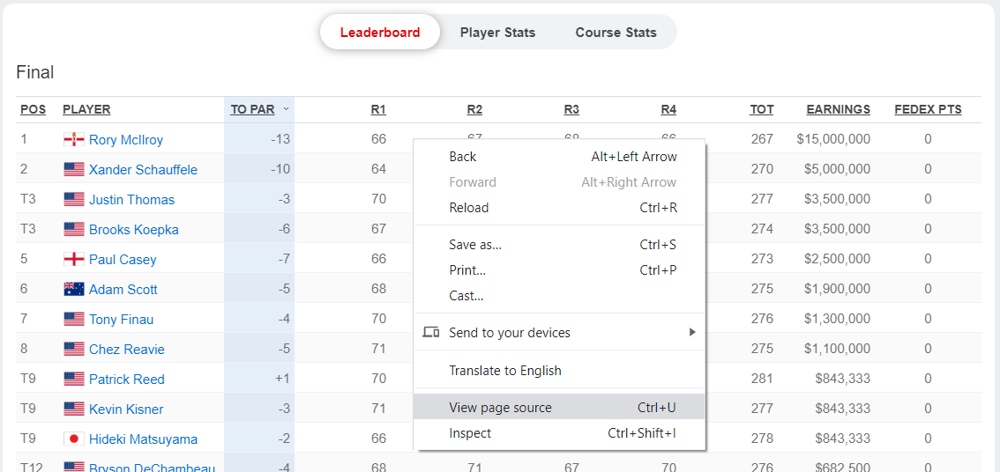
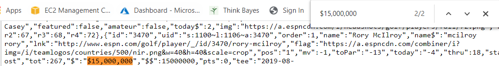
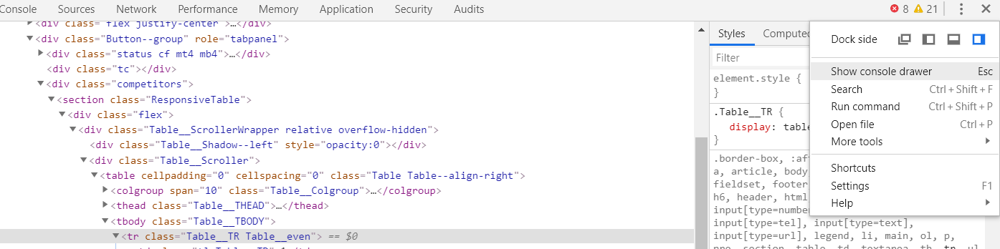
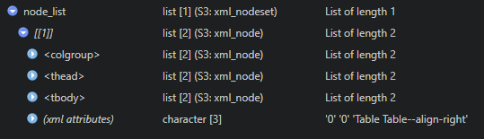

```{r setup, layout="1-body-outset", include=FALSE}
knitr::opts_chunk$set(echo = TRUE)
```

### Introduction
Web scraping. It can sound scary. I avoided it for as long as I could. If I was interested in analyzing some data, I searched the internet hoping to find a nice clean csv file. 
It was not until I came across this wonderful tutorial on web scraping by Peter Beshai: <https://beshaimakes.com/js-scrape-data> that I gained the confidence to give it a try on my own. 

### What we need
In this tutorial we are going to focus on scraping some PGA golf data from espn.com. We are going to start at this webpage: <https://www.espn.com/golf/leaderboard/_/tournamentId/401056542>. We will use the following libraries in R to scrape and clean our data.

```{r message = FALSE, warning = FALSE}
library(rvest)
library(tidyverse)
library(lubridate)
library(jsonlite)
library(janitor)
```

### HTML or API?
On our starting webpage there is a table of players and scores. This is the data I want. 

First, we must figure out how we can get our hands on this data. Let’s right click this table and choose ‘View Page Source’. 



Yikes! That looks a bit intimidating.

Despite it looking like a foreign language it is pretty easy to work with for our purposes here. We are just trying to figure out if our data is in the HTML code or an API. To do this, let’s search for a value in the table.  “$15,000,000” seems like a good one to me.



Just what we were looking for! This is a signal that the data I want is stored right in the HTML code.

### Where in the HTML?
First let's establish where we are by calling the website in R.

```{r}
url <- 'https://www.espn.com/golf/leaderboard/_/tournamentId/401056542'
webpage <- read_html(url)
```

Let's go back to our table on the webpage. Give it a right click and choose "Inspect". The devtools window should open up. This is where it can get messy. I am not an HTML expert and did a lot of playing around before figuring out exactly what I needed.

I'd recommend opening up the console and playing with the document.querySelectorAll() function. 




Hovering over the HTML code with your cursor will give you different things to call using the document.querySelectorAll() function.

Chances are that if we are trying to scrape data that appears in a table format we can simply call "table". Let's use the html_nodes function from rvest and see what that gives us.

```{r}
node_list <- webpage %>% 
  html_nodes("table")
```

Something I love about RStudio is how it allows us to easily view our object. If I look at what we now have in node_list I can see we got a nested list with some promising attributes. 



If I click the colgroup tag it looks like I get 10 col tags. This matches up with the 10 columns of our table on the webpage!

Clicking on the tbody tag it shows 30 tr tags. This matches up with the 30 players we have in the tournament!

### Okay, Now What?
Great, but I am looking for some nice clean data. Lucky for us rvest has a nice html_table function. Let's call it on the node_list object and see what happens.

```{r, layout="1-body-outset"}
leaderboard <- data.frame(node_list %>% 
  html_table())

library(rmarkdown)
paged_table(leaderboard)

```

Woah! Clean data with about 3 lines of code. Not sure what I have been scared of all this time. 

### Let's Go Deeper
Ok, great I got the leaderboard for one tournament. But I want the leaderboards for all the tournaments in a season. 

This will take a little more leg work and some dreaded data cleaning. Don't fear though, it is fairly straight forward!

If we go back to the webpage and again right click to "View Page Source" our messy HTML code pops up. It looks like each tournament url is called with a unique tournament id and the end of the web address. Let's see if this is in the code somewhere by searching (Ctrl+f) "401056542".

This search provides 60 results. Looking a little closer there are alot of urls popping up in the HTML with what appear to be unique tournament ids. Once again it looks like I can scrape the HTML code to get what I need.

Let's go back to our devtools window and begin the search. Generally, right clicking and choosing "Inspect" near the object you are looking to scrape will take you close to the data you need. For example, in this scenario I right clicked on the "Tournaments" dropdown.

After playing around in the code for a bit, we figure out we need the "optgroup" and "option" tags. Lets see what they return.

```{r}
webpage %>% 
  html_nodes('optgroup') %>% 
  html_nodes('option')
```

Nice, a bunch of urls with tournament ids. Now with a little data cleaning I can pull the ids from the urls and store them in a vector. I am going to grab the tournament names and dates as well. Using some regular expressions and the lubridate package I can grab the data. We are also going to need to call another node to grab the tournament dates. At the end of this block of code we will have a nice data frame of tournament ids, tournament names, and dates of tournaments.

```{r, layout="1-body-outset"}
tournament_id_data <- webpage %>% 
  html_nodes('optgroup') %>% 
  html_nodes('option')

grab_id <- "[[:digit:]]+" #reg expression to pull id from tournament/player links
grab_tournament_name <- "(?<=>).*(?=</option)" #(?<=> looks behind >), .* matches everything except new lines, (?=</option) looks ahead to match </option
grab_date <- "(?<=>).*(?=</span)"

tournament_ids <- integer() #empty vector to pull tournament ids for season
tournament_names <- character() ##empty vector to pull tournament names for season
tournament_dates <- character()

#loop id_data and grab tournament ids and names for individual seasons
for(i in 1:length(tournament_id_data)){
  to_string <- toString(tournament_id_data[i])
  #tournament ids
  tournament_id <- str_extract(to_string, grab_id)
  tournament_ids <- c(tournament_ids, tournament_id)
  
  #tournament names
  tournament_name <- str_extract(to_string, grab_tournament_name)
  tournament_names <- c(tournament_names, tournament_name)
  
  #tournament dates
  url <- paste0('https://www.espn.com/golf/leaderboard/_/tournamentId/', tournament_id)
  webpage <- read_html(url)
  tournament_date <- webpage %>% 
    html_nodes('span.Leaderboard__Event__Date.n7') %>% 
    toString() %>% 
    str_extract(grab_date)
  tournament_dates <- c(tournament_dates, tournament_date)
  
}

tournaments <- data.frame(tournament_ids, tournament_names, tournament_dates)

paged_table(tournaments)

```


I now have all the tournament ids for the 2019-2019 PGA season. Using the tournament ids vector created above I can pass the ids to call a new url each time and scrape the leaderboards for all tournaments.... 

Ok, I lied. There is a little more leg work. A few of the tournaments urls don't hand us a nice table. For example, <https://www.espn.com/golf/leaderboard/_/tournamentId/401077168> is "The Match: Tiger vs. Phil". No table here, just the scorecard for the two players. I am not too interested in this so I am going to remove this id along with a few others from our vector.

```{r}
remove_ids <- c("401077168", "401056529", "401056524", "401056560") #remove ids that won't work
tournament_ids <- tournament_ids[!tournament_ids %in% remove_ids]
```

I may also run into some situations where the html_nodes call returns more than one nested list. This is due to the tournament going to playoff holes. Below I handle this by checking if this call returns an object with a length == 1 or length == 2. If the object returns with a length of two, I ignore the first list which is the table for the playoff.

We will store the data in an empty dataframe we establish called "scores". 

We will also do some additional scraping to grab player ids. This will help us when we do analysis on the data and two players have the same name.

```{r}
#establish empty dataframe
scores <- tibble(pos = numeric(),
                 player = character(),
                 to_par = numeric(),
                 r1 = numeric(),
                 r2 = numeric(),
                 r3 = numeric(),
                 r4 = numeric(),
                 tot = numeric(),
                 earnings = numeric(),
                 fedex_pts = numeric())

for( t in 1:length(tournament_ids)){
  
  url <- paste0('https://www.espn.com/golf/leaderboard/_/tournamentId/', tournament_ids[t])
  webpage <- read_html(url)
  
  id_data <- html_nodes(webpage, 'a.AnchorLink.leaderboard_player_name') #links with player ids
  
  grab_id <- "[[:digit:]]+" #reg expression to pull id from player links
  ids <- integer() #empty vector to put player ids
  
  #loop id_data and grab only player ids
  for(i in 1:length(id_data)){
    to_string <- toString(id_data[i])
    id <- str_extract(to_string, grab_id)
    ids <- c(ids, id)
  }
  
  
  node_list <- webpage %>% 
    html_nodes("table")
  
  if(length(node_list) == 1){
    leaderboard <- node_list %>% 
      html_table(fill = TRUE) %>% 
      .[[1]] %>% 
      clean_names() %>% 
      mutate(player_id = ids)
  } else if(length(node_list) == 2) {
    leaderboard <- node_list %>% 
      .[2] %>% 
      html_table(fill = TRUE) %>% 
      .[[1]] %>% 
      clean_names() %>% 
      mutate(player_id = ids)
  } else {
    leaderboard <- tibble(pos = numeric(),
                 player = character(),
                 to_par = numeric(),
                 r1 = numeric(),
                 r2 = numeric(),
                 r3 = numeric(),
                 r4 = numeric(),
                 tot = numeric(),
                 earnings = numeric(),
                 fedex_pts = numeric(),
                 player_id = character())
  }
  leaderboard <- leaderboard %>% 
    mutate(tournament_id = tournament_ids[t])
  
  scores <- rbind(scores, leaderboard)
}

paged_table(scores)
```

There we go, I have the end result I am looking for in the scores dataframe!

### Conclusion
There are certainly more efficient ways to do this and probably some best practices I am not following. If anyone has suggestions please let me know. 

In the end, I am happy I was able to take the plunge and couquer my fear of web scraping!


